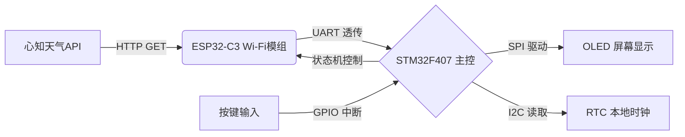
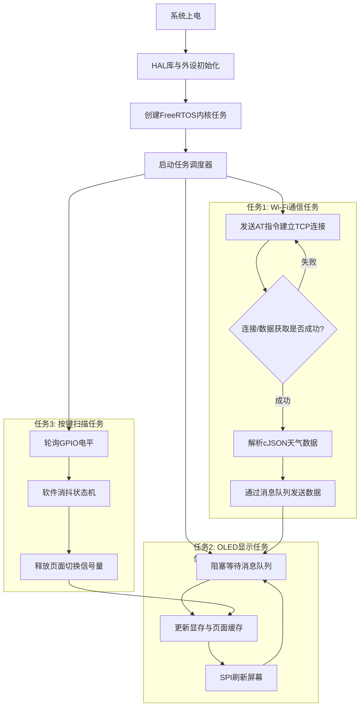

☁️ 基于开源FreeRTOS的智能天气时钟（改编版）

📌 项目简介
一款低功耗桌面天气时钟。通过ESP32-C3模块Wi-Fi联网，获取心知天气实时数据，并在OLED上多页面交互显示。项目采用“状态机”管理Wi-Fi连接与数据刷新，利用FreeRTOS多任务实现UI渲染、RTC计时与按键响应的解耦。

🧰 技术栈
主控: STM32F407ZGT6 (ARM Cortex-M4)
RTOS: FreeRTOS (任务调度、信号量、队列)
网络: ESP32-C3 (AT指令集, TCP透传)
外设: SPI (OLED驱显), I2C (RTC), UART (Wi-Fi通信)
协议/格式: HTTP GET, JSON解析 (cJSON库)
开发环境: STM32CubeMX + Keil MDK 5
## 📐 系统架构与软件流程图

### 硬件数据流框图

### FreeRTOS 多任务调度流程图

系统工作流程说明：
系统上电后，STM32CubeMX 生成的 HAL 库代码首先完成时钟配置（168MHz主频）及 SPI、UART、GPIO 外设初始化。随后，FreeRTOS 内核启动，创建三个核心任务：
1. WiFi通信任务（高优先级）：通过 UART 向 ESP32-C3 发送 AT指令集。先建立 TCP 连接，再向心知天气 API 发起 HTTP GET 请求。接收返回的 JSON 数据流后，利用 cJSON 库解析出温度及天气状况，并将有效数据通过消息队列发送给显示任务。该任务内置超时重试状态机，确保弱网环境下系统不死机。
2. OLED显示任务（中优先级）：阻塞等待消息队列，收到新数据后更新显示缓冲区，通过 SPI 驱动 SSD1306 刷新屏幕，支持多页面切换（主界面/详情页/曲线页）。
整个过程中，RTC 模块独立计时，与网络时间形成双时钟冗余。

🚀 快速开始（编译与烧录）
1. 配置密钥：将根目录的 `user_config.h`，填入你的WiFi SSID、密码和心知天气API Key。
2. 打开工程：使用Keil MDK 5打开 `/Project/Weather.uvprojx`。
3. 编译：勾选 `Use MicroLIB`，点击 `Rebuild` 全编译。
4. 烧录：使用ST-Link下载程序，打开串口助手（115200）查看调试日志。

🎥 运行效果展示
(这里放图片)
[主界面展示](Images/main_screen.jpg)
[多页面切换]（开发中）
(GIF动图更酷：用手机录屏软件拍屏幕，转到 https://ezgif.com 转成GIF放进来)*

📂 目录结构说明
- /Core：HAL库外设初始化及中断服务
- /ThirdLib：FreeRTOS源码及cJSON解析库
- /Project：Keil工程文件与编译链接脚本
- /Docs：硬件数据手册及系统设计文档

📝 待优化（Roadmap）
[ ] 实现蓝牙模块与手机连接
[ ] 增加图形化天气图标（动态雨滴/太阳）
[ ] 实现低功耗Sleep模式（待机电流降至uA级）
