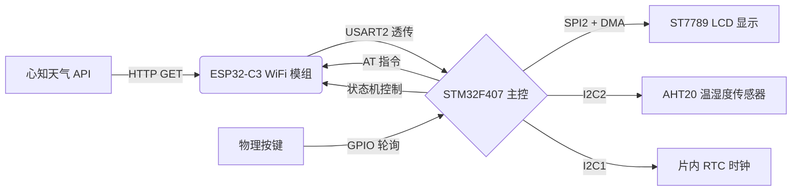
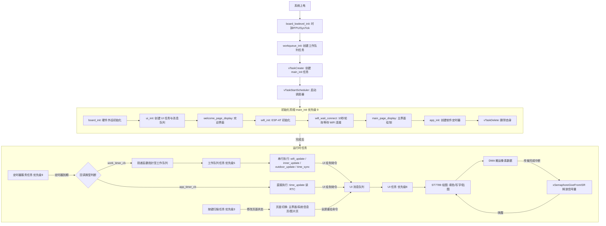

# ☁️ 基于 FreeRTOS 的智能天气时钟（STM32F407）

[](https://opensource.org/licenses/MIT)
[](https://www.freertos.org/)
[](https://www.st.com)

---

## 📌 项目简介

一款基于 **STM32F407ZGT6** 与 **FreeRTOS** 的多任务桌面天气时钟。通过 **ESP32-C3** 模块（ESP-AT 固件）联网，获取心知天气 API 实时数据，在 **ST7789 240x320 LCD** 屏幕上进行多页面交互显示。

项目采用 FreeRTOS 多任务架构，将 WiFi 通信、传感器采集、UI 渲染、按键响应拆分为独立任务，通过**消息队列**与**信号量**实现任务间同步与数据传递。核心亮点包括：

- **工作队列（Work Queue）**：将定时器回调中的耗时业务异步延迟至任务上下文执行，确保定时器服务任务零阻塞
- **DMA + 二值信号量**：SPI 屏幕数据传输由 DMA 搬运，配合信号量实现传输完成通知，CPU 在搬运期间可调度其他任务
- **多页面 UI 状态机**：支持主界面/系统信息页/全屏图片页切换，后台刷新函数通过页面可见性校验防止画面污染
- **SNTP 动态重试**：网络时间同步失败时自动缩短重试间隔，成功后恢复长周期运行

> ⚠️ **注意事项**：若您想连接自己的 WiFi 和心知天气 API，请将 `user_config.h` 文件中的 WiFi 账户密码和 API Key 修改为自己的。

---

## 🧰 技术栈

| 组件 | 型号/方案 |
|------|-----------|
| 主控 | STM32F407ZGT6（ARM Cortex-M4 @168MHz） |
| RTOS | FreeRTOS（任务调度、消息队列、信号量、软件定时器） |
| WiFi 模块 | ESP32-C3（乐鑫 ESP-AT 固件，USART2 通信） |
| 温湿度传感器 | AHT20（I2C1 接口） |
| 显示屏幕 | ST7789 240x320 LCD（SPI2 + DMA） |
| 实时时钟 | STM32 片内 RTC（外接 32.768KHz 晶振） |
| 通信协议 | USART（AT 指令）、I2C、SPI |
| 数据格式 | HTTP GET、JSON 解析（轻量级 strstr/sscanf） |
| 开发环境 | Keil MDK 5 + STM32CubeMX |

---

## 📐 系统架构与流程图

### 硬件数据流框图



### FreeRTOS 多任务调度与同步机制流程图



### 定时器驱动业务更新周期表

```mermaid
gantt
    title 软件定时器业务更新周期
    dateFormat  ss
    axisFormat %S秒
    section 高速
    RTC时间刷新 (1秒)    :active, t1, 0, 1s
    section 中速
    WiFi状态查询 (5秒)   :t2, 0, 5s
    温湿度采集 (3秒)     :t3, 0, 3s
    section 低速
    天气HTTP请求 (1分钟) :t4, 0, 60s
    SNTP时间同步 (动态)  :crit, t5, 0, 3600s
```



---

## ⚙️ 核心机制详解

### 1. 工作队列（Work Queue）—— 中断下半部设计

所有软件定时器的业务回调（WiFi 查询、传感器读取、HTTP 请求）均通过 `work_timer_cb` 将函数指针投递至工作队列，由独立的 `workqueue_task`（优先级 5）串行执行。

**设计目的**：FreeRTOS 定时器回调在定时器服务任务（优先级 9）中执行，该任务不应执行阻塞操作。通过工作队列将耗时任务延迟至低优先级任务上下文，确保定时器服务任务零阻塞。

### 2. DMA + 二值信号量并行刷屏

`st7789_write_gram` 启动 DMA 传输后立即调用 `xSemaphoreTake` 阻塞，DMA 传输完成中断中调用 `xSemaphoreGiveFromISR` 释放信号量唤醒任务。CPU 在 DMA 搬运期间可调度其他任务。

### 3. 多页面 UI 状态机与防脏数据刷新

```c
typedef enum {
    PAGE_MAIN,
    PAGE_SYSINFO,
    PAGE_IMAGE
} Page_t;
```

- 物理按键触发页面切换（主界面 ↔ 系统信息页 ↔ 全屏图片页）
- 所有后台定时器刷新函数（`time_update` / `inner_update` / `wifi_update` / `outdoor_update`）在执行 UI 绘制前判断 `g_current_page`，非主界面时直接返回，杜绝画面污染

### 4. SNTP 动态重试机制

`time_sync` 函数在 SNTP 同步失败时调用 `xTimerChangePeriod` 将定时器重置为 1 秒后重试；同步成功后恢复为 1 小时周期。

---

## 🚀 快速开始（编译与烧录）

### 1. 配置密钥

打开 `user_config.h`，填写以下宏定义：

```c
#define WIFI_SSID     "你的WiFi名称"
#define WIFI_PASSWD   "你的WiFi密码"
#define WEATHER_API_KEY "你的心知天气API Key"
```

### 2. 打开工程

使用 Keil MDK 5 打开 `Project/Weather.uvprojx`。

### 3. 编译

勾选 `Use MicroLIB`，点击 `Rebuild` 全编译。

### 4. 烧录

使用 ST-Link 下载程序，打开串口助手（115200-8-N-1）查看调试日志。

---

## 🎥 运行效果展示

| 界面 | 描述 |
|------|------|
| 主界面 | 时间/日期、室内温湿度、室外天气、WiFi 连接状态 |
| 系统信息页 | WiFi SSID/RSSI、系统运行时长、FreeRTOS 任务栈剩余 |
| 全屏图片页 | 240x320 RGB565 全屏图片渲染 |

> 📷 充效果截图
> 
> 

> 
> 


---

## 📂 目录结构说明

```
/Core        - HAL 库外设初始化及中断服务
/ThirdLib    - FreeRTOS 源码
/Project     - Keil 工程文件
/Drivers     - ST7789/AHT20/ESP-AT 驱动
/App         - 业务逻辑（定时器、工作队列、页面管理）
/UI          - UI 消息队列与绘图封装
```

---

## 📝 待优化（Roadmap）

- [ ] 解决单工作队列在 HTTP 阻塞场景下的队头阻塞问题（方案：独立任务或非阻塞状态机）
- [ ] 增加 WiFi 运行时断线自动重连机制
- [ ] 实现低功耗 Sleep 模式
- [ ] 增加更多天气图标（动态雨滴/太阳）

---

## 📄 License

MIT © Gaofayi
