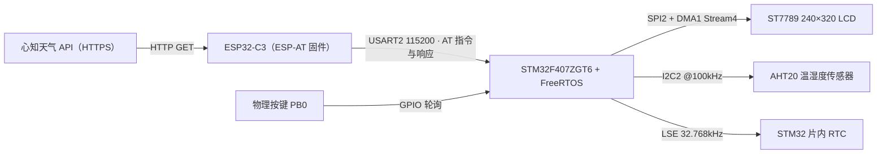
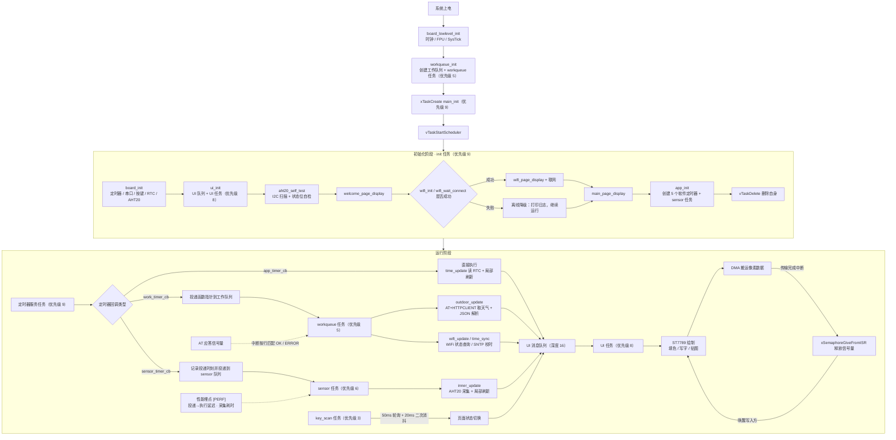

# ☁️ 基于 FreeRTOS 的智能天气时钟（STM32F407）

[](https://opensource.org/licenses/MIT)
[](https://www.freertos.org/)
[](https://www.st.com)

---

## 📌 项目简介

一款基于 **STM32F407ZGT6** 与 **FreeRTOS** 的多任务桌面天气时钟（本项目基于梅花十三香FreeRTOS天气时钟开源工程二次开发）。通过 **ESP32-C3** 模块（ESP-AT 固件）联网，获取心知天气 API 实时数据，在 **ST7789 240x320 LCD** 屏幕上进行多页面交互显示。

项目采用 FreeRTOS 多任务架构，将 WiFi 通信、传感器采集、UI 渲染、按键响应拆分为独立任务，通过**消息队列**与**信号量**实现任务间同步与数据传递。核心亮点包括：

- **工作队列（Work Queue）**：将定时器回调中的耗时业务异步延迟至任务上下文执行，确保定时器服务任务零阻塞
- **DMA + 二值信号量**：SPI 屏幕数据传输由 DMA 搬运，配合信号量实现传输完成通知，CPU 在搬运期间可调度其他任务
- **多页面 UI 状态机**：支持主界面/系统信息页/全屏图片页切换，后台刷新函数通过页面可见性校验防止画面污染
- **SNTP 动态重试**：网络时间同步失败时自动缩短重试间隔，成功后恢复长周期运行

> ⚠️ **注意事项**：若您想连接自己的 WiFi 和心知天气 API，请将 `user_config.h` 文件中的 WiFi 账户密码和 API Key 修改为自己的。

---

## 🧰 技术栈

| 组件 | 型号/方案 |
|------|-----------|
| 主控 | STM32F407ZGT6（ARM Cortex-M4 @168MHz） |
| RTOS | FreeRTOS（任务调度、消息队列、信号量、软件定时器） |
| WiFi 模块 | ESP32-C3（乐鑫 ESP-AT 固件，USART2 通信） |
| 温湿度传感器 | AHT20（I2C2，PB10/PB11，7 位地址 0x38） |
| 显示屏幕 | ST7789 240x320 LCD（SPI2 + DMA） |
| 实时时钟 | STM32 片内 RTC（外接 32.768KHz 晶振） |
| 通信协议 | USART（AT 指令）、I2C、SPI |
| 数据格式 | HTTP GET、JSON 解析（轻量级 strstr/sscanf） |
| 开发环境 | Keil MDK 5 + STM32CubeMX |

---

## 📐 系统架构与流程图

### 硬件数据流框图


```mermaid
graph LR
    API["心知天气 API（HTTPS）"] -->|HTTP GET| ESP["ESP32-C3（ESP-AT 固件）"]
    ESP -->|"USART2 115200 · AT 指令与响应"| MCU["STM32F407ZGT6 + FreeRTOS"]
    MCU -->|"SPI2 + DMA1 Stream4"| LCD["ST7789 240×320 LCD"]
    MCU -->|"I2C2 @100kHz"| AHT["AHT20 温湿度传感器"]
    MCU -->|"LSE 32.768kHz"| RTC["STM32 片内 RTC"]
    KEY["物理按键 PB0"] -->|GPIO 轮询| MCU
```

### FreeRTOS 任务与同步机制


```mermaid
graph TD
    BOOT["系统上电"] --> LL["board_lowlevel_init<br/>时钟 / FPU / SysTick"]
    LL --> WQ["workqueue_init<br/>创建工作队列 + workqueue 任务（优先级 5）"]
    WQ --> IT["xTaskCreate main_init（优先级 9）"]
    IT --> SCHED["vTaskStartScheduler"]

    subgraph INIT["初始化阶段 · init 任务（优先级 9）"]
        I1["board_init<br/>定时器 / 串口 / 按键 / RTC / AHT20"] --> I2["ui_init<br/>UI 队列 + UI 任务（优先级 8）"]
        I2 --> I3["aht20_self_test<br/>I2C 扫描 + 状态位自检"]
        I3 --> I4["welcome_page_display"]
        I4 --> I5{"wifi_init / wifi_wait_connect 是否成功"}
        I5 -->|成功| I6["wifi_page_display + 联网"]
        I5 -->|失败| I7["离线降级：打印日志，继续运行"]
        I6 --> I8["main_page_display"]
        I7 --> I8
        I8 --> I9["app_init<br/>创建 5 个软件定时器 + sensor 任务"]
        I9 --> I10["vTaskDelete 删除自身"]
    end

    subgraph RUN["运行阶段"]
        TS["定时器服务任务（优先级 9）"] --> CB{"定时器回调类型"}
        CB -->|app_timer_cb| D1["直接执行<br/>time_update 读 RTC + 局部刷新"]
        CB -->|work_timer_cb| Q1["投递函数指针到工作队列"]
        CB -->|sensor_timer_cb| Q2["记录投递时刻并投递到 sensor 队列"]

        Q1 --> WT["workqueue 任务（优先级 5）"]
        WT --> J2["outdoor_update<br/>AT+HTTPCLIENT 取天气 + JSON 解析"]
        WT --> J3["wifi_update / time_sync<br/>WiFi 状态查询 / SNTP 校时"]

        Q2 --> ST["sensor 任务（优先级 6）"]
        ST --> J4["inner_update<br/>AHT20 采集 + 局部刷新"]

        D1 --> UQ["UI 消息队列（深度 16）"]
        J2 --> UQ
        J3 --> UQ
        J4 --> UQ

        UQ --> UT["UI 任务（优先级 8）"]
        UT --> DR["ST7789 绘制<br/>填色 / 写字 / 贴图"]
        DR --> DMA["DMA 搬运像素数据"]
        DMA -->|传输完成中断| SG["xSemaphoreGiveFromISR 释放信号量"]
        SG -->|唤醒写入方| DR

        KT["key_scan 任务（优先级 3）"] -->|"50ms 轮询 + 20ms 二次消抖"| PS["页面状态切换"]
        PS --> UQ

        ATS["AT 应答信号量"] -.->|"中断按行匹配 OK / ERROR"| WT
        PERF["性能埋点 [PERF]<br/>投递→执行延迟 · 采集耗时"] -.-> ST
    end

    SCHED --> INIT
    INIT --> RUN
```

### 任务划分

| 任务 | 优先级 | 栈（words） | 职责 |
|------|:---:|:---:|------|
| init（main_init） | 9 | 1024 | 外设、UI、网络初始化，完成后自删除 |
| 定时器服务任务 | 9 | 由 FreeRTOS 配置 | 运行 5 个软件定时器的回调（`configTIMER_TASK_PRIORITY = configMAX_PRIORITIES - 1`） |
| ui（ui_func） | 8 | 1024 | 独占 ST7789，串行执行填色 / 写字 / 贴图三类绘制动作 |
| sensor（sensor_task） | 6 | 512 | AHT20 采集（3 秒周期），与网络请求解耦 |
| workqueue（work_func） | 5 | 1024 | 单消费者串行执行网络与业务任务 |
| key_scan | 3 | 512 | 50ms 轮询 + 20ms 二次消抖，切换页面状态 |

> 调度配置：`configUSE_PREEMPTION = 1`（抢占式）、`configUSE_TIME_SLICING = 1`（同级时间片轮转）、`configTICK_RATE_HZ = 1000`、`configMAX_PRIORITIES = 10`。

### 软件定时器

| 定时器 | 周期 | 回调 | 业务 | 执行位置 |
|------|------|------|------|------|
| time_update | 1 秒 | app_timer_cb | 读 RTC、比较数据变化、局部刷新时间与日期 | 定时器服务任务内直接执行 |
| inner_update | 3 秒 | sensor_timer_cb | AHT20 采集 + 局部刷新温湿度 | sensor 任务 |
| wifi_update | 5 秒 | work_timer_cb | 查询 WiFi 连接状态与 RSSI，变化时刷新界面 | workqueue 任务 |
| outdoor_update | 1 分钟 | work_timer_cb | `AT+HTTPCLIENT` 获取天气 JSON 并刷新 | workqueue 任务 |
| time_sync | 1 小时（失败时 1 秒） | work_timer_cb | SNTP 校时写入 RTC，失败自动缩短重试周期 | workqueue 任务 |


```mermaid
gantt
    title 软件定时器业务更新周期
    dateFormat  ss
    axisFormat %S秒
    section 高速
    RTC时间刷新 (1秒)    :active, t1, 0, 1s
    section 中速
    温湿度采集 (3秒)     :t3, 0, 3s
    WiFi状态查询 (5秒)   :t2, 0, 5s
    section 低速
    天气HTTP请求 (1分钟) :t4, 0, 60s
    SNTP时间同步 (1小时) :crit, t5, 0, 3600s
```

### 队列与同步机制

| 机制 | 深度 | 用途 |
|------|:---:|------|
| work queue | 16 | 投递「函数指针 + 参数」，由单消费者任务串行执行网络与业务 |
| sensor queue | 8 | 仅传递投递时刻，用于采集调度与延迟统计 |
| UI queue | 16 | 绘制命令（动作枚举 + 联合体三态）；字符串经 `pvPortMalloc` 拷贝、渲染后 `vPortFree` |
| 定时器命令队列 | 32 | FreeRTOS 内部使用（`configTIMER_QUEUE_LENGTH`） |
| DMA 完成信号量 | 二值 | DMA 传输完成中断中 `xSemaphoreGiveFromISR` 唤醒写入方 |
| AT 应答信号量 | 二值 | 命令发送后等待应答，中断按行匹配后唤醒等待任务 |

### 一次数据更新的完整链路（以天气刷新为例）

1. `outdoor_update_timer`（1 分钟）到期，`work_timer_cb` 把函数指针投递到工作队列；
2. workqueue 任务取出任务，拼出 `AT+HTTPCLIENT` 命令经 DMA 发送，并等待 AT 应答信号量；
3. ESP32-C3 内部完成 DNS 解析、TCP 连接、TLS 握手与 HTTP 请求，回传 JSON 响应体；
4. `weather.c` 用 `strstr` 定位字段、`sscanf` 提取城市 / 天气 / 温度 / 天气代码；
5. 解析结果写入全局变量，并向 UI 队列投递「写字 + 贴图」消息；
6. UI 任务执行绘制，像素数据经 SPI2 + DMA 分块搬运，传输完成中断释放信号量；
7. 若当前不在主界面，刷新函数在入口处直接返回（页面可见性校验），避免污染非活动页面。

### 离线降级行为

网络初始化或连接失败时不再进入死循环，而是打印日志并继续运行：设备保持 RTC 走时、AHT20 采集与显示、按键切换页面等本地功能，主界面 WiFi 区域显示 `wifi lost`，天气区域保留上一次数据。

> 后续规划：为 WiFi 增加状态机与指数退避重连，把「离线」从终态变为可恢复状态。

---

## ⚙️ 核心机制详解

### 1. 工作队列（Work Queue）—— 中断下半部设计

网络与慢周期业务（WiFi 状态查询、天气 HTTP 请求、SNTP 校时）通过 `work_timer_cb` 将函数指针投递至工作队列，由独立的 `workqueue` 任务（优先级 5）串行执行；AHT20 采集（3 秒周期）则由 `sensor_timer_cb` 投递到独立的 sensor 队列，由 sensor 任务（优先级 6）执行，避免被秒级的 HTTP 请求阻塞。

**设计目的**：FreeRTOS 定时器回调在定时器服务任务（优先级 9）中执行，该任务不应执行阻塞操作。通过工作队列与独立传感器任务把耗时业务延迟到任务上下文，既保证定时器服务任务零阻塞，也让快周期采集不被慢请求拖累。

### 2. DMA + 二值信号量并行刷屏

`st7789_write_gram` 启动 DMA 传输后立即调用 `xSemaphoreTake` 阻塞，DMA 传输完成中断中调用 `xSemaphoreGiveFromISR` 释放信号量唤醒任务。CPU 在 DMA 搬运期间可调度其他任务。

### 3. 多页面 UI 状态机与防脏数据刷新

```c
typedef enum {
    PAGE_MAIN,
    PAGE_SYSINFO,
    PAGE_IMAGE
} Page_t;
```

- 物理按键触发页面切换（主界面 ↔ 系统信息页 ↔ 全屏图片页）
- 所有后台定时器刷新函数（`time_update` / `inner_update` / `wifi_update` / `outdoor_update`）在执行 UI 绘制前判断 `g_current_page`，非主界面时直接返回，杜绝画面污染

### 4. SNTP 动态重试机制

`time_sync` 函数在 SNTP 同步失败时调用 `xTimerChangePeriod` 将定时器重置为 1 秒后重试；同步成功后恢复为 1 小时周期。

### 5. 队头阻塞优化与性能埋点

SNTP、WiFi 状态、天气 HTTP 三个业务共用同一个单消费者工作队列，天气请求最长阻塞 5 秒，会推迟 3 秒周期的传感器采集，属于典型的队头阻塞。

为此将 AHT20 采集拆分为独立的 sensor 任务（优先级 6、栈 512 words）与专用队列（深度 8）：定时器回调仅记录投递时刻并以 0 超时投递，队列满时计数丢弃而不阻塞；两种模式通过编译开关 `ENABLE_SEPARATE_SENSOR_TASK` 切换，便于对比。同时加入性能埋点，统计「定时器投递 → 任务实际执行」的延迟与单次采集耗时，每 10 次输出一行 `[PERF]` 日志。

> AT 指令层目前仍是「发送后阻塞等待应答」的实现，进一步优化方向是将 AT 交互改造为事件驱动的状态机，从根本上消除阻塞等待。

---

## 🚀 快速开始（编译与烧录）

### 1. 配置密钥

打开 `user_config.h`，填写以下宏定义：

```c
#define WIFI_SSID     "你的WiFi名称"
#define WIFI_PASSWD   "你的WiFi密码"
#define WEATHER_API_KEY "你的心知天气API Key"
```

### 2. 打开工程

使用 Keil MDK 5 打开 `Project/Weather.uvprojx`。

### 3. 编译

勾选 `Use MicroLIB`，点击 `Rebuild` 全编译。

### 4. 烧录

使用 ST-Link 下载程序，打开串口助手（115200-8-N-1）查看调试日志。

---

## 🎥 运行效果展示

| 界面 | 描述 |
|------|------|
| 主界面 | 时间/日期、室内温湿度、室外天气、WiFi 连接状态 |
| 系统信息页 | WiFi SSID/RSSI、系统运行时长、FreeRTOS 任务栈剩余 |
| 全屏图片页 | 240x320 RGB565 全屏图片渲染 |

> 📷 效果截图
> 

> 

> 

> 

[![点击观看演示视频]
【基于开源FreeRTOS的多页面天气时钟-哔哩哔哩】 https://b23.tv/h6nKxDG

---

## 📂 目录结构说明

```
/Core        - HAL 库外设初始化及中断服务
/ThirdLib    - FreeRTOS 源码
/Project     - Keil 工程文件
/Drivers     - ST7789/AHT20/ESP-AT 驱动
/App         - 业务逻辑（定时器、工作队列、页面管理）
/UI          - UI 消息队列与绘图封装
```

---

## 📝 待优化（Roadmap）

- [ ] 解决单工作队列在 HTTP 阻塞场景下的队头阻塞问题（方案：独立任务或非阻塞状态机）
- [ ] 增加 WiFi 运行时断线自动重连机制
- [ ] 实现低功耗 Sleep 模式
- [ ] 增加更多天气图标（动态雨滴/太阳）

---

## 📄 License

MIT © Gaofayi
